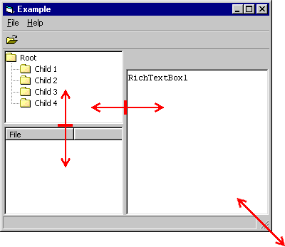



## Application example \(template\) with splitbars like Windows Explorer

### Description

Here's an application example (it can be template for your new application) with splitbars like Windows Explorer. Following code describe you how you can make scalable parts of forms with splitbars.
 
### More Info
 

             |
---                |---
**Submitted On**   |2001-01-06 01:23:28
**By**             |[Alexei Smirnov](https://github.com/Planet-Source-Code/PSCIndex/blob/master/ByAuthor/alexei-smirnov.md)
**Level**          |Beginner
**User Rating**    |4.3 (30 globes from 7 users)
**Compatibility**  |VB 6\.0
**Category**       |[Coding Standards](https://github.com/Planet-Source-Code/PSCIndex/blob/master/ByCategory/coding-standards__1-43.md)
**World**          |[Visual Basic](https://github.com/Planet-Source-Code/PSCIndex/blob/master/ByWorld/visual-basic.md)
**Archive File**   |[CODE\_UPLOAD13442162001\.zip](https://github.com/Planet-Source-Code/alexei-smirnov-application-example-template-with-splitbars-like-windows-explorer__1-14179/archive/master.zip)

